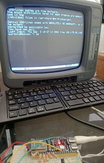

# ESP32 Terminal



Vintage B/W CRT terminal (320x240) on an ESP32-S3 with composite video via
**LCD_CAM + GDMA**. Graphics layer: **LVGL** (8-bit grayscale). Keyboard:
**BLE** (HID host / HOGP with NimBLE). Remote session: **SSH** to a host
(`LibSSH-ESP32`).

## Features

- Full-screen interactive SSH session (libssh + pty) with a masked local
  password prompt on the CRT and automatic reconnect with backoff.
- BLE HID host keyboard with auto-discovery (for rotating addresses), Spanish
  ISO layout with AltGr, or USB HID boot protocol.
- Status bar (row 27) with NTP time, WiFi/SSH/keyboard icons and transient
  messages (pairing PIN, password prompt).
- P39-style phosphor persistence and a 4000-line scrollback buffer in PSRAM.

## Status

| Milestone | Description | Status |
|-----------|-------------|--------|
| M0 | Video (LCD_CAM+GDMA) + LVGL on CRT | Done |
| M1 | Terminal rendering: VT100 parser + LVGL widget | Done |
| M2 | BLE keyboard (HOGP host) | Done |
| M3 | Interactive SSH (libssh + pty) | Done |
| M4 | Hardening: RAM to PSRAM, reconnect, phosphor | Done |

## Configuration

The WiFi/SSH values (SSID, password, host, user) are **placeholders** in
`src/config.h`. The SSH password is typed on the CRT on every connection
(ADR-0002), or you can set `TERM_SSH_PWD` for auto-login.

## Source provenance

- `src/video_s3.{h,cpp}` — **verbatim copy** of the NTSC LCD_CAM+GDMA driver
  (bus GPIO4/5/6/7/15/16/40/41) from the `lunarlander` / `esp32LanderS3`
  project. If it evolves here, decide explicitly whether to mirror it back to
  the game; there is no automatic sync.
- `src/lv_conf.h` — from the LVGL 9.5.0 `lv_conf_template.h`, trimmed down
  (widgets the terminal does not use, `LV_COLOR_DEPTH 8`).

## Dependencies

- Core: `esp32:esp32` ≥ 3.3.10 (IDF 5.x, required by the GDMA driver).
- Arduino libraries: `lvgl@9.5.0`, `NimBLE-Arduino`, `LibSSH-ESP32`.

## Build / flash

```sh
bash build.sh                    # build
bash flash.sh                    # flash to /dev/ttyACM0
```

FQBN: `esp32:esp32:esp32s3:PSRAM=opi,PartitionScheme=huge_app` (`huge_app`
required since M3 because of the binary size with libssh).

## Architecture (summary)

```
loopTask (core 1):  video_wait_frame() → lv_timer_handler() → flush ⇒ fbShadow
sshTask   (core 0): WiFi + libssh (pty) ; rx→term, tx from keyboard
BLE keyboard:       NimBLE host (HOGP) → events → queue → loopTask
```

Terminal grid: 56 cols × 27 rows (5×8 px cells), scrollback in PSRAM.